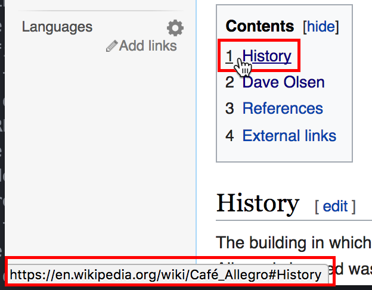

# Browser History Mechanics
We're going to look at old, traditional browser history mechanics (like **back**
and **forward**) and see how they're built for an old internet where people
browsed between lots of different pages. We'll talk about the rise of modern
Single Page Applications that allow people to do lots of things without ever
leaving a webpage. We'll see how the rise of Single Page Applications broke
old, traditional browser history mechanics and led to the introduction of new
ways for web sites to control what **back** and **forward** really mean.

## Objectives
* Understand old browser history mechanics
* Introduce URL routing
* Introduce Single Page Applications (SPAs)
* Understand why old browser history mechanics don't work for SPAs
* Introduce modern browser history mechanics

# Browser History Mechanics
Browsers have built in history mechanics. You can go **back** and **forward**
between pages you've been been to and you can **reload** the page you're on.

## Exercise
Open a new tab in your browser and navigate to the Wikipedia article for
(Cafe Allegro)[https://en.wikipedia.org/wiki/Cafe_Allegro] in Seattle.

* Hover over the "1. History" link in the Contents section
  
* Look in the lower left of your browser to see the URL the link leads to
* Notice the URL looks like `wikipedia.org/wiki/Cafe_Allegro#history`,
  specifically note the hashtag `#history`
* Click the history link and notice how it scrolls you down in the same page.
* Hover over the link to "Seattle" near the top of the article and look at
  the URL.
* Notice that the URL looked like `wikipedia.org/wiki/Seattle` and does not
  include `Cafe_Allegro`, and there's no hash tag. The URL is a URL to a
  different page.
* Click the link to "Seattle" and notice how your browser goes blank, loads
  another page and shows you the next article for UW.
* Click on several more links and keep an eye out to notice when the browser
  goes blank and totally loads a new page.
* Hold down your mouse on the **back** button. You'll see a drop down menu
  showing every page you've been on.
  
Holding down the back button to look at your browser history should show
something like this:

Browser history mechanics are built for going **back** and **forward** between
different pages. Browsers have the back and forward buttons for users. These
actions are also available to us in JavaScript. We can write JavaScript programs
that invoke `window.history.back()` and `window.history.forward()`.

Pages can be all on the same site, or on many different sites. Browsing pages on
one site is like viewing different articles on Wikipedia, or viewing different
movie pages on IMDB. Browsing pages on different sites is like using a search
engine to look up a restaurant, looking at Yelp's website, going back to the
search engine website, and looking at a restaurant's official website. The
browser is still visiting different *pages* they're just on different *sites*.

It's important to specifically note what a "page" is. A page is a whole HTML
file that your browser downloads and displays. You know you're navigating
between two different pages when you see your browser screen go blank, then
slowly load in a totally new page.

We're going into detail about what a page is in order to draw contrast to how
modern web applications don't use multiple pages like they used to. Modern web
applications are now often what we call **Single Page Applications**.

Before we get into Single Page Applications, let's talk about URL routing.

# What is URL Routing?
**Routing** defines what content is displayed when someone visits a certain a
URL. If I go to `http://github.com/` I would expect to see GitHub's homepage.
If I got to `http://github.com/login` I would expect to see a login page. Each
of these URLs is a **route**. A route pairs a URL with the content that should
be displayed for that URL. You should be able to visit a webpage, copy the URL
to a friend, and they should end up viewing the same page.

Let's look at an example of how content is routed by URLs by looking at the
General Assembly homepage.

Go to <https://generalassemb.ly/>. Interact with the menu in the top bar on
the right. You should see options for things like "On Campus," "Locations," and
"About." Click on the different links to pages and notice the URLs that you end
up at. Hover over the links to see their URL to save yourself from actually
navigating off the page.

This table shows the **path** for each URL. The path of a URL is everything
after the domain name. In this case the path is everything that appears
after "https://generalassemb.ly" in the location bar of the browser. The `/`
path is a special path called the root. It's the homepage.

Compare the paths in the URLs and get a sense for how URLs are routed to
content. Websites URLs are general split into succinct, descriptive,
hierarchical categories. Notice how going to `/locations` takes you to a page
showing all campus locations, then each specific location is in a hierarchy
under that, like `/locations/london` and `/locations/singapore`.

| **URL Route**                       | **Content**                                              |
|-------------------------------------|----------------------------------------------------------|
| /                                               | Homepage                                     |
| /about                                          | General Information                          |
| /education                                      | Shows all local upcoming courses             |
| /education/web-development-immersive            | WDI course details                           |
| /education/user-experience-design-immersive     | UX course details                            |
| /locations                                      | Shows all global GA locations                |
| /locations/london                               | Shows London-specific location information   |
| /locations/singapore                            | Shows London-specific location information   |

You can see that URLs *route* users to content. When someone types in a URL
they are ultimately shown content associated with that URL.

Have you ever tried to send someone a link to what you're looking at on Google
Maps and then when they click on your link they end up looking at something
completely different? That's a great example of bad URL routing. (Google Maps
is actually much better about this these days.) URLs should represent the
main content of the page you're looking at!

Old web sites that spread their content across multiple pages use URLs to route
users to different pages. Modern Single Page Applications actually only have
one page, but they use URLs to route users to see different content on that one
page.

# Modern Single Page Applications
Modern web applications let you do lots of things on just one page. They try to
minimize how often you have to go to a new page where you see your browser go
blank and load everything over again. Instead, modern web apps serve just one
page and they change parts of the *contents* of the page dynamically, without
having to reload the entire page or send users to another page.

Websites that serve up only one page and change the content of the page
dynamically without reload the page are called **Single Page Applications**.

Open your browser and navigate to Gmail:

* When you load Gmail you see your inbox
* You can start instant messaging a friend in a sidebar
* You can start to compose a new email to your manager to request time off
* You can search for an email with flight information
* You can browse through more email to make sure you've talked your manager
  about getting time off before

This all happens on one page! The page never refreshes. The chat bar with your
friend never disappears as you compose an email and search through your inbox.

Gmail fits the definition of a **Single Page Application**. Gmail loads one
page just once and that page replaces content dynamically to show you many
different things. That single page changes its content dynamically without
reloading or sending you to another page. It's great!

Consider the benefits of a single page application:
* It's fast. Users don't have to wait for a page to reload over and over.
* It's persistent. You can have a chat window open in one corner and keep
  talking to a friend as the rest of Gmail switches between showing you your
  inbox, an email, or email search results.

## Single Page Apps Break Old History Mechanics!
Now here's the catch. Here's why we went into such detail about browser history
mechanics and defining what exactly Single Page Applications are.

Single Page Applications break the initial design of Browser History Mechanics.
The **back** and **forward** actions were built specifically to go back and
forth between different pages. Since single page apps only change the content
of themselves without actually sending users to different web pages the notion
of **back** and **forward** is lost.

When users press the **back** button in a Single Page Application they go back
off the one page, completely out of the Single Page Application.

Imagine being on Facebook, going to Gmail, going through several views of
different email inboxes, search results and then pressing the back button.

* Go to facebook.com
* Type in www.gmail.com to check your email
* Click on one email
* Search your email for plane tickets
* Click on on email to see ticket information
* Click **back** to go back to plane ticket search results
* You would end up back at facebook.com

Since Gmail is a Single Page Application pressing the back button will take
the user all the way back to Facebook! Really, the user just wanted to go back
to their email search results.
 
## Introducing Modern Browser History Mechanics
Web Developers, users, and browser vendors all love Single Page Applications.
They're a great experience that the Internet community should embrace. At one
point people got together in committees and devised a way to upgrade the old
browser history mechanics to accommodate modern Single Page Applications.

The modern HTML5 specification (published October 2014) introduced new browser
history mechanics to make Single Page Applications easier to browse **back** and
**forward** even through they actually stay on the same page.

HTML5 introduced `.pushState` and `.replaceState` functions that allow web pages
to save custom history data to the browser. Now applications like Gmail can use
these functions to manually save custom browser history. When someone goes from
their inbox to a specific email Gmail can use `.pushState` to save information
about what the user is currently doing in the application. Now when the user
presses the **back** button the browser gives the saved information back to
Gmail and Gmail brings back the content the user was last looking at.

It's good that HTML5 introduced new browser history mechanics to make it easier
for us developers to build Single Page Applications. We're actually not going to
be using these new features directly ourselves. Instead, we'll use a tool called
**React Router** that bundles many concepts together and allows us to create our
own Single Page Applications extremely easily. So even though we won't use the
new history mechanics firsthand ourselves it's still important to know that our
framework is taking care of that for us under the hood.

# Recap
Here's a summary of what we've learned today:

### Single Page Applications and Browser History Mechanics
* Single Page Applications are websites that serve only one web page, then
  change the content of that page dynamically, without refreshing.
* Old browser history mechanics support **back** and **forward** operations that
  traditionally keep track of history as users move between different pages.
* Since modern Single Page Applications keep the user on one page without
  refreshing old browser history **back** and **forward** mechanics don't work
  well with modern applications.
  
# What's Next: React Router
In the next section we'll see how we can use **React Router** in our **React**
applications to easily create our own Single Page Applications. We'll see how
React Router allows us to route URLs to components with content, and we'll see
how React Router automatically manages history using modern browser history
mechanics.

## Licensing
All content is licensed under a CC­BY­NC­SA 4.0 license.
All software code is licensed under GNU GPLv3. For commercial use or alternative licensing, please contact legal@ga.co.
