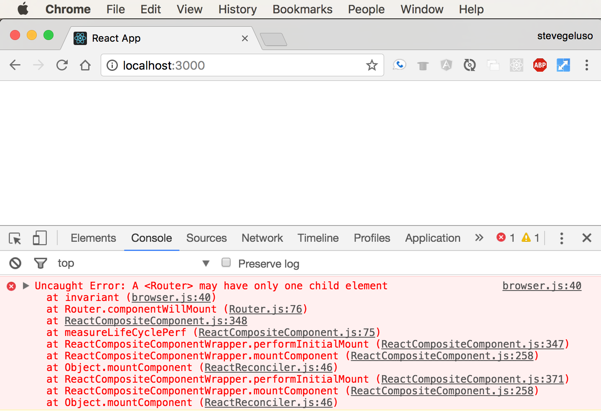

# Intro to React Router

## Objectives
* Review how websites use URLs to route content
* Review what it means for a website to be a Single Page Application
* Introduce React Routers main features: routing, components, history
* Use React Router to map URLs to components
* Use React Router to create links to different pages

# Intro to React Router
**React Router** is a third-party library that makes it easy for us to route
specific URLs to specific content on our page. In our React app different
content will be grouped up in its own regular **React** component. Once we
define how the URLs are routed to the components **React Router** will
manage our Single Page App's browser history automatically.

Here's what React Router provides:

* **Routing:** easily define what content is associated with what URLs.
* **History:** automatically manage browser history when navigating between
  content.

React Router is actually a **third-party** library. Third Party just means it's
not built by React and it's not built by ourselves. It's been written by some
other "third-party" group of developers. Even though React Router is third-party
software it's extremely useful, trustworthy, and popular.

# The Plan: Our Example Dentist Website
We'll make an example Dentist website that has a `Home` page, a page that lists
available `Procedures` and a page displaying `Contact` information. Each of
these pages of content will be built into their own regular **React** component,
then we'll create a unique URL route that leads to each component.

Here's how we'll route our Single Page Application.

| **URL Route**  | **Component**  | **Content Description**                          |
|----------------|----------------|--------------------------------------------------|
| /              | `<Home>`       | A homepage with welcome text.                    |
| /procedures    | `<Procedures>` | A list of all dentist procedures.                |
| /contact       | `<Contact>`    | A page with an address, phone number, and email. |

Remember, the URL routes are paths off our main website. We could put our
website at any domain, like `www.ourdentistwebsite.com` or
`www.premiumdental.com`, and the URL route paths would behave the same. Paths
only care about what comes after the domain name.

Our routes say that if someone goes to `ourdomain.com/` they will see our
homepage with welcome text. The content of this page will all be defined in its
own component in a file called `home.js`. If someone navigates to the URL
`ourdomain.com/contact` then they'll see content with the business address,
a phone number and an email. All of this content will be defined in a component
called `Contact` in a file called `contact.js`.

You can see all of the final code and a live working copy of the site here:

Full Repo: <https://github.com/geluso/react-router-simple-dentist-site>

Live Site: <https://react-router-dentist.herokuapp.com/>

# Installing React Router
Let's see how to set up a new React project and install **React Router**. You
should have the `create-react-app` command line tool installed. This tool makes
it easy to start making a **React** app.

Since **React Router** is a third-party library we'll need to use `npm
install --save react-router-dom` to download **React Router** and save it as
a dependency in our project.

* `npm install` is the command used to install libraries to our project.
* The `--save` flag tells `npm install` to save the thing we're downloading to
  our `package.json` file as a dependency. Saving the library as a dependency
  makes it easy for us to copy our project to another machine and just run
  `npm install` to install all of the dependencies for our project.
* `react-router-dom` is the official name of **React Router**

So, in summary, we're telling `npm install` to find the library package called
`react-router-dom`, install the package, and save the name of our package to our
file that keeps track of all the packages for our project.

If you don't use the `--save` flag then `npm install` will still find the
package and download it. It just won't save the package to your `package.json`
file so you can easily install all your saved dependencies later on if you move
to another machine.

## In Your Terminal
```
create-react-app dentist-website
cd dentist-website
npm install --save react-router-dom
npm start
```

Your browser should open to <http://localhost:3000/> and you'll see the standard
"Welcome to React" message with a fancy rotating atomic icon. `create-react-app`
creates several files for us in a directory called `src`. Open the `App.js`
file in your editor.

`App.js` contains our main application. You should see the basic HTML structure
of the standard React starter page. Make sure the file is the same thing you're
looking at in the browser by finding the text `Welcome to React` inside an
`<h2>` element.

Change the text to say `My First React Router App`, save the file and make sure
you see the changes automatically appear in your browser. The page should
automatically refresh. If it doesn't automatically refresh then try to manaully
refresh the page. If you still don't see changes after a manual refresh then
something could be wrong. Make sure you're editing the right file.

**Pro tip:** It's a good idea to make simple, verifiable changes like this when
you're first starting to make changes to a project. It's like a sanity check.
Make sure you can do simple things first. Don't start with complex things.
Many things can go wrong when you make complex changes. Prove to yourself you
can make small changes and you'll save yourself headaches debugging large
complex changes.

# Create Custom Homepage
Let's get rid of the standard "Welcome to React" page and replace it with our
own Dentist Website Homepage. Continue editing `App.js`. Gut most of the HTML
contents, and delete the import statement for the `logo.svg` which we won't use.

The `App.js` file contains one component that our whole App will live inside
of. Remember that React components have a `render(){ ... }` function that
defines what the component will look like when it is rendered on the webpage.
The render function alway has to return *at most* one top-level element. It's
common to wrap everything in your component in a `<div>` to make sure you
satisfy this constraint.

I added one `<h1>` That says `Dentist Website` and added a paragraph with some
short welcome text. My `App.js` file now looks like this. Save the file and go
to your browser to make sure these changes show up.

**App.js**
```
import React, { Component } from 'react';
import './App.css';

class App extends Component {
  render() {
    return (
      <div>
        <h1>Dentist Website</h1>
        <p>
          Welcome to my dentist website.
        </p>
      </div>
    );
  }
}

export default App;
```

Good. Now we have a simple homepage set up. Let's move on to getting the rest
of the content for our site set up.

# Creating Our Homepage Component
We've been editing `App.js` which defines one component for our entire
application. So far our app manually shows just the homepage. Let's refactor
this so the content of the homepage is moved into it's own component called
`Home`.

1. Create a new file called `Home.js`.
2. Copy and paste everything inside `App.js` into `Home.js` to use it as a
  template for how to create a React component.
3. Delete the import statement for `./App.css`.
4. Find everywhere the file says `App` and rename it to `Home`. This code used
  to create a component called `App`. Now we're rewriting it to create a
  component called `Home`.
5. Look at the `render() { ... }` function and verify that it's returning
  content that represents our homepage. It should just be the one top-level
  `<div>`, the `<h1>` and a `<p>` paragraph element if you used the same
  content as above. Great. We actually don't need to make any changes here!
6. Go back to `App.js` and delete the `<h1>` and `<p>` tags where we used to
  have the Home content written directly inside our `App` component. We don't
  need that written inside `App` any more because we just moved it all to the
  new `Home` component.
7. Add `<Home></Home>` inside the `<div>` in the `App` component. This tells the
  `App` component to render the `Home` component right there inside the div.
8. Look at the browser and see if the homepage appears. It wont. You'll see an
  error. The error should look like below.


It's not enough to simply create the `Home.js` file and create the `Home`
component. We must also import the component into the `App.js` file.

Your `App.js` and `Home.js` files should look like this after you've properly
created and imported the `Home` component.

**App.js**
```js
import React, { Component } from 'react';
import './App.css';
import Home from './Home';

class App extends Component {
  render() {
    return (
      <div>
        <Home></Home>
      </div>
    );
  }
}
export default App;
```

**Home.js**
```js
import React, { Component } from 'react';

class Home extends Component {
  render() {
    return (
      <div>
        <h1>Dentist Website</h1>
        <p>
          Welcome to my dentist website.
        </p>
      </div>
    );
  }
}

export default Home;
```

# Create Components for Procedures and Contact
The purpose of our site is to create several components that we can swap out
as the main content of the main page of our application in order to create a
modern Single Page Application. We need to create two new components and then
we can start routing things up.

1. Create a new file called `Procedures.js`
2. Create a new file called `Contact.js`

Refer to the finished example repo to see the contents of these files. The files
were created using the same procedure we used to create the `Home` component
using the `App` component as a template. Basically: create each file, change the
name of the component to its new name, then replace the HTML in the
`render() { ... }` function with custom content. Be sure to import each new
component into `App.js` just like we did with the `Home` component.

Refer to these complete files in the finished repo to make sure you got
everything correct:

<https://github.com/geluso/react-router-simple-dentist-site/blob/master/src/procedures.js>
<https://github.com/geluso/react-router-simple-dentist-site/blob/master/src/contact.js>

You can render each of these components all at once inside the `App` component
by making sure each one is imported, and referencing them like `<Home></Home>`
in the `App` render function.

**App.js**
```js
import React, { Component } from 'react';
import './App.css';

import Home from './Home';
import Procedures from './Procedures';
import Contact from './Contact';

class App extends Component {
  render() {
    return (
      <div>
        <Home></Home>
        <Procedures></Procedures>
        <Contact></Contact>
      </div>
    );
  }
}

export default App;
```

## Displaying Pages Individually
You should see all of content for each of the pages all stacked on top of each
other on the homepage. If you don't see content from all three of your
components then something is wrong. You must fix this before continuing. Always:
do simple things before doing complex things!

Try manually deleting two of the three components so only one component is left
on the page at a time. You should see your webpage update with just that
component. This is effectively what **React Router** does. We can React Router
so that its aware of each component we want to show on the screen and React
Router will swap the components out so that only one of them is shown at a time.

Now that we've proven to ourselves that we're able to show each of the
components on the main page it's time to hook them up to Router.

# Creating Routes
Here's the general syntax for creating routes. You must have one `<Router>`
component that wraps itself around multiple `<Route>` components. Each `<Route>`
component has a `path` attribute and a `component` attribute that defines
what component users will see when the navigate to the URL at the page.

```
<Router>
  <div>
    <Route exact path="/" component={HomePage} />
    <Route path="/courses" component={CoursesPage} />
    <Route path="/locations" component={LocationsPage} />
  </div>
</Router>
```

Notice that all of the `<Route>` components are wrapped inside one `<div>`. The
`<Router>` requires that it only has one direct child element. If you don't
wrap the routes with a `<div>` the page will appear blank and you'll have to
open your JavaScript console to see that there's an error being logged to the
console.

**Pro tip:** It's a good habit to check the console for errors whenever your
app is not behaving as expected.



Notice that the first route for the homepage at the root URL path `/` uses a
special extra `exact` attribute before defining the path. The `exact` attribute
means the component associated with the route will only be shown if users are
at that URL path exactly. If you forget to include the `exact` keyword then
when someone navigates to `/courses` they will actually see two components
because `/` is a partial match for `/courses`.

React Router uses three of it's own components to define how URLs are routed
to components, and to create links to those routes. Let's look at each of the
three in summary:

* **\<Router>** - this component is a container component that all the other
  React Router components must be wrapped inside of.
* **\<Route>** - this component creates a definition routing one URL to a
  component. This component has two attributes:
  * **path** - defines the URL path that leads to the component. If someone
    types in the URL defined here then the site will display the component as
    the content of the page.
  * **component** - a reference to the component to show as content when
    someone navigates to the URL.
* **\<Link>** - This component creates `<a>` tags and automatically integrates
  modern HTML5 browser history mechanics for the Single Page Application. It
  has one attribute:
  * **to** - this attribute defines what path to navigate to.
    
## Import Statements
In order to use the React Router components you'll need to import them. This
import syntax allows us to grab several specific components out of the
`react-router-dom` library at once. One component is called `BrowserRouter`
inside the library package but we use the `as` keyword to rename it to
`Router` so it's available in shorthand.

```
import {
  BrowserRouter as Router,
  Route,
  Link
} from 'react-router-dom';
```

## Fully Routed
Here's how the imports and all the components look like together for our dentist
website:

**app.js**
```
import React, { Component } from 'react';
import './App.css';

import {
  BrowserRouter as Router,
  Route,
  Link
} from 'react-router-dom';

import Home from './Home';
import Procedures from './Procedures';
import Contact from './Contact';


class App extends Component {
  render() {
    return (
      <Router>
        <div>
          <Route exact path="/" component={Home} />
          <Route path="/procedures" component={Procedures} />
          <Route path="/contact" component={Contact} />
        </div>
      </Router>
    );
  }
}

export default App;
```  

# Navigate to the Routes
Now that everything is hooked up you can manually enter different URLs and
see how your page appears. If you go to <http://localhost:3000/> You should
see the homepage. If you go to <http://localhost:3000/procedures> you should
see just the procedures page. If you go to <http://localhost:3000/contact>
then you should see just the contact page.

Make sure that React Router is routing from each URL to the proper component
correctly. Double check to make sure that the home page doesn't display at the
same time as another component. If the homepage is shown while you're at the
path to `/procedures` or `/contact` then you probably did not write the `exact`
keyword when you defined the `/` Home route.

## Debugging Common Errors
Let's intentionally make an error. Delete the `exact` keyword off the Home
route. Navigate to the `/procedures` page and the `/contact` page again and
see how the components are displayed. You should see the content of the
homepage and the content for one of the other pages at the same time, with
the home page on top.

Now add the `exact` keyword back to the home route and notice that the pages
don't double up any more.

Two common errors:
1. If the page appears blank open the JavaScript console to see if there are
  errors. Chances are you have a typo somewhere or forgot to make sure the
  `<Router>` only has one child element. Wrap all of your `<Route>` components
  in one `<div>`.
2. If multiple components appear on the page at the same time there's
  something with how you've routed URLs. Make sure you use the `exact`
  keyword on the root path `/` and make sure there's no duplicate URL paths
  defined anywhere.

# Adding a Nav Section
Great, now our site is up and running! We can manually type in URLs and see the
different pages.

Wouldn't it be nice to have links at the top of the page so we can click on
things and go to pages instead of manually typing in the URL? React Router
provides a component called `<Link>` that generates `<a>` tags that link
to the different routed views in our application. We'll add one `<Link>`
component that leads to each of our different content pages.

Each `<Link>` component takes an attribute `to` that we can give a URL path.
We can wrap `<Link>` tags around text that we want to display in the link.

Here's what our links will look like. Notice that the `to` attribute uses the
URL path. The text in between the `<Link>` tags is just text that will display
in the link. There's no reference to components here. Instead, we reference the
URLs and allow **React Router** to use the URL to route users to the proper
components.

```js
<Link to="/">Go to Home Page</Link>
<Link to="/procedures">See Our Procedures</Link>
<Link to="/contact">Contact Us!</Link>
```

We can include those links in a `<nav>` element at the top of our page.
It will stay on the page permanently and the different components will be
swapped between each other below it. There's actually nothing special about
the `<nav>` element. It behaves exactly like a `<div>`. `<nav>` Is just a
semantic element that gives your HTML more meaning when people read it.

There's one slightly annoying thing about React here. React strips out
whitespace between elements. If we write `<Link>` components next to each
other, even if they're on new lines, React strips all of the whitespace
(spaces, returns, tabs...) between them and squishes them all together. We
must insert a space manually by writing `{' '}` in order to get spaces between
our links.

Here's how we'll write the links:

```
<Link to="/">Go to Home Page</Link>{' '}
<Link to="/procedures">See Our Procedures</Link>{' '}
<Link to="/contact">Contact Us!</Link>
```

If we don't write `{' '}` between the links then the links will appear like
the screenshot on the left (all squished together) instead of having nice
spaces between them like the nav on the right.


# Final Code
Here's what our final `App.js` looks like:

```js
class App extends Component {
  render() {
    return (
      <Router>
        <div>
          <nav>
            <Link to="/">Go to Home Page</Link>{' '}
            <Link to="/procedures">See Our Procedures</Link>{' '}
            <Link to="/contact">Contact Us!</Link>
          </nav>
          <Route exact path="/" component={Home} />
          <Route path="/procedures" component={Procedures} />
          <Route path="/contact" component={Contact} />
        </div>
      </Router>
    );
  }
}

export default App;
```

### React Router Recap
* Single Page Applications have specific URLs that are routed to display
  different content.
* React Router is a third-party library that we can install and use with React.
* Since React Router isn't built in to React we must import it's components.
* React Router makes it easy for us to route URLs to components.
* React Router automatically manipulates modern browser history mechanics.

## Licensing
All content is licensed under a CC­BY­NC­SA 4.0 license.
All software code is licensed under GNU GPLv3. For commercial use or alternative licensing, please contact legal@ga.co.
